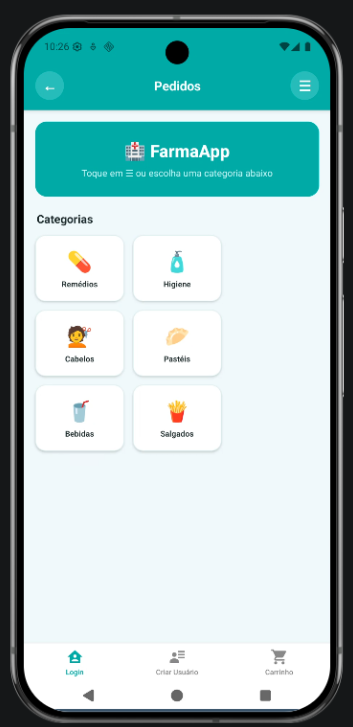
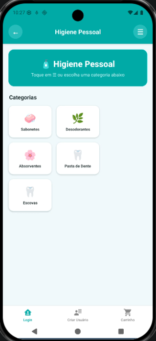
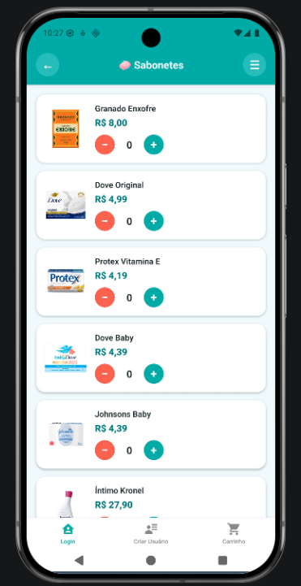
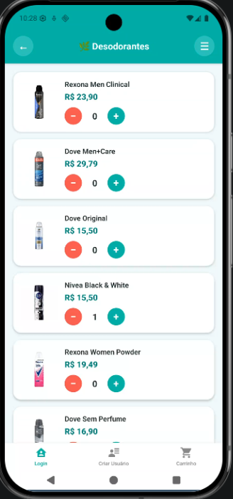
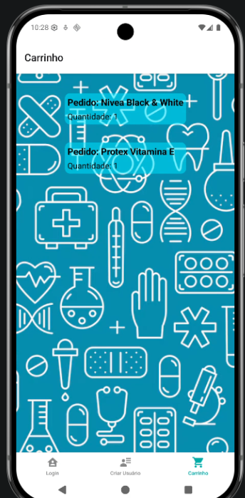

# FARMACIA CUIDA+

## INTEGRANTES
GUILHERME MATIAS RODRIGUES DE SOUZA RA: 22.122.071-8 </br>
CAIO ARNONI RA 22.221.019-7 </br>
TAINÁ CUNHA BUENO RA 22.119.025-9 

## 1. Objetivo do Laboratório

## Cuidar+ | Farmácia e Saúde 💚💊
  
A Cuidar+ nasce com um propósito simples e poderoso: ir além da venda e oferecer cuidado de verdade.

Trabalhamos com medicamentos, dermocosméticos, suplementos, produtos ortopédicos e itens de cuidado diário — sempre com curadoria técnica e acompanhamento farmacêutico.

Na Cuidar+, acreditamos que saúde não é apenas tratar sintomas, mas prevenir, orientar e estar presente. Por isso, oferecemos:

- Atendimento farmacêutico personalizado
- Orientação sobre uso correto de medicamentos
- Espaço organizado, acessível e humanizado

Mais do que uma farmácia, somos um ponto de apoio à comunidade. Um espaço onde o cuidado é prioridade, a escuta é ativa e a confiança é construída todos os dias.

Cuidar+  porque saúde é mais do que produto, é presença. 💚

## 2. Definição do Domínio do Sistema
### Descrever, em poucas linhas:
* Qual é o domínio do sistema? </br>
Sistema de gestão e apoio operacional para uma farmácia física com foco em atendimento humanizado e controle de vendas. </br>

* Qual problema real ele resolve? </br>
Controle ineficiente de estoque </br>
Falta de organização no cadastro de clientes </br>
Dificuldade em acompanhar vendas </br>
Falta de registro de atendimentos farmacêuticos </br>
Risco de perda por vencimento de medicamentos </br>

* Quem são os principais usuários? </br>
Farmacêutico responsável </br>
Atendentes da farmácia </br>
Gerente / proprietário </br>


## 3. Visão Geral do Sistema
### Preencher os itens abaixo:
* Nome do sistema: </br>
  Farmacia Cuidar+ </br>
  
* Usuários principais:</br>
Farmacêuticos </br>
Atendentes </br>
Gerente da unidade </br>

* Principais funcionalidades (alto nível)</br>
Cadastro de clientes</br>
Cadastro e controle de medicamentos</br>
Controle de estoque com alerta de vencimento</br>
Registro de vendas</br>
Registro de atendimentos farmacêuticos</br>
Relatórios de vendas e produtos mais vendidos</br> 
Controle de caixa</br>


## 4. Identificação dos Processos de Negócio
## Identificar de 2 a 4 processos principais do domínio.
## Para cada processo, descrever:
🔹 Processo 1: Venda de Medicamento

Entrada:
Solicitação do cliente / Receita médica

Saída:
Venda registrada e atualização do estoque

Atores envolvidos:
Cliente
Atendente
Sistema

🔹 Processo 2: Controle de Estoque

Entrada:
Cadastro de novos produtos / Entrada de mercadoria

Saída:
Atualização de estoque / Alerta de vencimento

Atores envolvidos:
Gerente
Farmacêutico
Sistema

🔹 Processo 3: Atendimento Farmacêutico

Entrada:
Solicitação de orientação do cliente

Saída:
Registro de atendimento no sistema

Atores envolvidos:
Farmacêutico
Cliente
Sistema

🔹 Processo 4: Geração de Relatórios Gerenciais

Entrada:
Dados de vendas e estoque

Saída:
Relatórios de desempenho

Atores envolvidos:
Gerente
Sistema
## 5. Diagrama Simplificado de Processo


## 6. Preparação do Ambiente
* Criar repositório do projeto (Git)
* Definir linguagem e framework </br>
React </br>
EXPO GO </br>
* Registrar essas decisões no README

--------------------------------------
# Parte 2

#  Parte 1 – Identificação de Pontos de Reuso

Foram identificados os seguintes pontos de reuso no sistema:

---

##  Estrutura Base do Aplicativo Mobile
- **Framework:** React Native + Expo  

O uso do React Native com Expo permite reutilização de componentes, desenvolvimento multiplataforma e acelera a criação do aplicativo.

---

##  Componentes de Formulário (Clientes, Produtos, Vendas)
- **React Hook Form** → gerenciamento de formulários  
- **Yup** → validação de dados  

Permite reaproveitar regras de validação e reduzir repetição de código em diferentes cadastros.

---

##  Autenticação de Usuários
- **Backend:** Node.js + Express  
- **Banco de Dados:** Firebase (Firestore + Authentication)  
- **Biblioteca:** JWT (JSON Web Token)  

Utiliza padrão moderno de autenticação com API REST e controle de sessão seguro.

---

##  Sistema de Navegação (Busca / Catálogo)
- **Biblioteca:** React Navigation  

Organiza o fluxo entre telas e permite separação lógica entre módulos.

---

##  API de Pagamento Online
- **API Externa:** Mercado Pago  

Reuso de serviço financeiro consolidado, evitando desenvolvimento de sistema próprio de pagamento.

---

##  Controle de Estoque e Alertas de Vencimento
- **Banco:** Firebase (Firestore)  
- **Biblioteca:** date-fns  

Permite cálculo de vencimentos e gerenciamento de estoque de forma organizada.

---

##  Geração de Relatórios
- **Banco:** Firebase  
- **Biblioteca:** React Native Chart Kit  

Permite geração de gráficos (linha, barra e pizza) para visualização de vendas e controle de estoque.

---

#  Parte 2 – Análise de Critérios Técnicos e Arquiteturais

---

##  React Native + Expo (Framework Mobile)

### Critérios Técnicos
- Ampla utilização no mercado  
- Boa documentação  
- Comunidade ativa  
- Compatibilidade com JavaScript  

### Critérios Arquiteturais
- Arquitetura modular baseada em componentes  
- Redução do tempo de desenvolvimento  
- Facilidade de manutenção e evolução futura  

---

##  Node.js + Express (Backend)

### Critérios Técnicos
- Leve e amplamente utilizado  
- Fácil integração com aplicações React  
- Grande ecossistema de bibliotecas  

### Critérios Arquiteturais
- Separação clara entre frontend e backend  
- Estruturação via API REST  
- Baixo acoplamento entre camadas  

---

##  Firebase (Firestore + Authentication)

### Critérios Técnicos
- Plataforma moderna e consolidada  
- Integração direta com React Native  
- Backend como serviço (BaaS)  
- Autenticação integrada  

### Critérios Arquiteturais
- Redução da complexidade (sem necessidade de servidor próprio)  
- Escalabilidade automática  
- Sincronização em tempo real  
- Agilidade na implementação  

---

##  React Navigation

### Critérios Técnicos
- Biblioteca oficial do ecossistema React Native  
- Fácil implementação  

### Critérios Arquiteturais
- Organização do fluxo entre telas  
- Separação lógica entre funcionalidades  

---

##  React Hook Form + Yup

### Critérios Técnicos
- Redução de código repetitivo  
- Padronização de validações  

### Critérios Arquiteturais
- Centralização das regras de validação  
- Redução de inconsistências nos dados  

---

##  Mercado Pago (API de Pagamento)

### Critérios Técnicos
- Solução consolidada e segura  
- Conformidade com padrões de segurança  

### Critérios Arquiteturais
- Evita desenvolvimento de sistema financeiro próprio  
- Reduz riscos de segurança  
- Mantém foco no domínio da farmácia  

---

##  React Native Chart Kit

### Critérios Técnicos
- Biblioteca amplamente utilizada  
- Fácil integração com Expo  
- Suporte a gráficos de linha, barra e pizza  
- Boa documentação  

### Critérios Arquiteturais
- Reutilização de componentes de visualização  
- Separação entre lógica (dados Firebase) e apresentação (gráficos)  
- Organização modular do sistema

## Análise Arqueteturial


---------------------------------------------------------------------
# Parte 3 - Diagrama de Componentes de Software


# Casos de Uso — Farmácia Cuidar+

---

## UC01 – Gerenciar Estoque

| **Identificação** | **UC01 –Gerenciar Estoque** |
|---|---|
| **Função** | Permitir ao gerente cadastrar, atualizar e monitorar produtos e quantidades disponíveis no estoque. |
| **Atores** | Gerente |
| **Pré-condição** | Gerente autenticado no sistema com permissões administrativas. |
| **Pós-condição** | Estoque atualizado corretamente no sistema. |
| **Fluxo Principal** | **1. Atualizar estoque:**<br>a) Gerente acessa módulo de estoque;<br>b) Seleciona cadastrar ou atualizar produto;<br>c) Informa dados (nome, quantidade, validade);<br>d) Sistema salva informações;<br>e) Sistema confirma atualização. |
| **Fluxo Alternativo** | **2. Produto já existente:**<br>a) Gerente seleciona produto cadastrado;<br>b) Sistema permite apenas atualização de quantidade ou validade;<br>c) Sistema salva alterações. |
| **Fluxo Exceção** | **3. Erro ao salvar dados:**<br>a) Sistema tenta salvar informações;<br>b) Ocorre erro no banco;<br>c) Sistema informa falha ao usuário. |

---
## UC02 – Validação de Receita

| **Identificação** | **UC02 – Validação de Receita** |
|---|---|
| **Função** | Permitir que o cliente envie uma receita médica e que o farmacêutico valide ou rejeite o documento. |
| **Atores** | Cliente, Farmacêutico |
| **Pré-condição** | Cliente autenticado no sistema. |
| **Pós-condição** | Receita registrada como aprovada ou rejeitada e cliente notificado. |
| **Fluxo Principal** | **1. Enviar receita:**<br>a) Cliente acessa opção de envio de receita;<br>b) Cliente envia imagem ou arquivo;<br>c) Sistema registra envio;<br>d) Farmacêutico acessa receitas pendentes;<br>e) Farmacêutico analisa documento;<br>f) Farmacêutico aprova ou rejeita;<br>g) Sistema notifica cliente sobre resultado. |
| **Fluxo Alternativo** | **2. Receita ilegível ou incompleta:**<br>a) Farmacêutico analisa receita;<br>b) Farmacêutico identifica inconsistência;<br>c) Sistema solicita novo envio ao cliente. |
| **Fluxo Exceção** | **3. Erro no upload:**<br>a) Cliente envia arquivo;<br>b) Sistema detecta falha;<br>c) Sistema informa erro;<br>d) Cliente tenta novamente. |

## UC03 – Realizar Compra

| **Identificação** | **UC03 – Realizar Compra** |
|---|---|
| **Função** | Permitir que o cliente selecione produtos, envie receita quando necessário e finalize uma compra pelo aplicativo. |
| **Atores** | Cliente |
| **Pré-condição** | Cliente autenticado no sistema e aplicativo disponível para uso. |
| **Pós-condição** | Pedido registrado com sucesso, pagamento processado e estoque atualizado. |
| **Fluxo Principal** | **1. Comprar produtos:**<br>a) Sistema apresenta lista de produtos;<br>b) Cliente seleciona produtos;<br>c) Cliente adiciona ao carrinho;<br>d) Cliente confirma a compra;<br>e) Sistema processa pagamento;<br>f) Sistema registra pedido;<br>g) Sistema atualiza estoque;<br>h) Sistema exibe confirmação da compra. |
| **Fluxo Alternativo** | **2. Produto com receita obrigatória:**<br>a) Cliente seleciona produto controlado;<br>b) Sistema solicita envio da receita;<br>c) Cliente envia receita;<br>d) Sistema registra receita e continua processo de compra.<br><br>**3. Cancelar compra:**<br>a) Cliente acessa carrinho;<br>b) Cliente remove produtos;<br>c) Sistema atualiza carrinho;<br>d) Cliente pode encerrar processo sem finalizar pedido. |
| **Fluxo Exceção** | **4. Falha no pagamento:**<br>a) Sistema tenta processar pagamento;<br>b) Ocorre erro na transação;<br>c) Sistema informa falha;<br>d) Cliente pode tentar novamente ou cancelar. |

---

# Parte 3 - Interfaces de Software

### UC01 – Gerenciar Estoque
- Interface de Estoque
- Interface de Autenticação

### UC02 – Validação de Receita
- Interface de Receitas
- Interface de Autenticação

### UC03 – Realizar Compra
- Interface de Compras
- Interface de Pagamento
- Interface de Estoque
- Interface de Autenticação
  
---

## Componente 1 — Auth (Autenticação e Sessão)

- **Responsabilidade:** login e cadastro de usuários, controle de acesso ao app.
- Interfaces fornecidas (provides):
  - IAutenticacaoService
    - `autenticar(usuario, senha)` — valida credenciais e libera acesso
    - `cadastrar(usuario, senha)` — registra novo usuário
- Interfaces requeridas (requires): nenhuma

> **Status atual:** login e cadastro funcionando com AsyncStorage local.
> Integração com Firebase Authentication planejada para próxima etapa.

---

## Componente 2 — Estoque (Inventário de Produtos)

- **Responsabilidade:** manter o catálogo de produtos disponíveis por categoria (Higiene, Cabelos, Remédios, etc.), com nome, preço e imagem.
- Interfaces fornecidas (provides):
  - IEstoque
    - `listarPorCategoria(categoria)` — retorna produtos de uma categoria
    - `cadastrarProduto(nome, preco, categoria)` — adiciona produto ao catálogo
    - `atualizarProduto(nome, preco)` — atualiza dados do produto
- Interfaces requeridas (requires):
  - IAutenticacaoService (para verificar permissão de gerente)

> **Status atual:** catálogo de produtos implementado localmente (dados fixos no código).
> Integração com Firebase Firestore planejada para próxima etapa.

---

## Componente 3 — Compras (Carrinho e Pedido)

- **Responsabilidade:** exibir catálogo, permitir adição e remoção de itens no carrinho, persistir o pedido.
- Interfaces fornecidas (provides):
  - ICarrinhoService
    - `salvar(nomeProduto, quantidade)` — persiste item no carrinho
    - `remover(nomeProduto)` — remove item do carrinho
    - `listar()` — retorna todos os itens do carrinho
- Interfaces requeridas (requires):
  - IAutenticacaoService (usuário autenticado para acessar o carrinho)
  - IEstoque (listar produtos disponíveis por categoria)

> **Status atual:** carrinho implementado e funcionando com AsyncStorage.
> Categorias implementadas: Higiene Pessoal, Cabelos, Remédios, Pastéis, Bebidas, Salgados.

---

## Componente 4 — Receitas (Validação Farmacêutica)

- **Responsabilidade:** envio de receita médica pelo cliente e validação pelo farmacêutico para produtos controlados.
- Interfaces fornecidas (provides):
  - IReceitas
    - `enviarReceita(imagem)` — cliente envia foto da receita
    - `consultarStatus(receitaId)` — verifica se receita foi aprovada ou rejeitada
    - `validarReceita(receitaId, decisao)` — farmacêutico aprova ou rejeita
- Interfaces requeridas (requires):
  - IAutenticacaoService (para validar perfil do farmacêutico)
  - INotificacao (para avisar o cliente sobre o resultado)

> **Status atual:** planejado. Será implementado em etapa futura.

---

## Componente 5 — Pagamento

- **Responsabilidade:** processar o pagamento do pedido integrado ao Mercado Pago.
- Interfaces fornecidas (provides):
  - IPagamento
    - `criarCobranca(pedidoId, valor)` — gera cobrança no gateway
    - `consultarStatus(transacaoId)` — verifica se pagamento foi aprovado
- Interfaces requeridas (requires):
  - IAutenticacaoService (vincular transação ao usuário autenticado)
  - Mercado Pago API (serviço externo)

> **Status atual:** planejado. Será implementado em etapa futura.

---

## Componente 6 — Notificações

- **Responsabilidade:** enviar notificações ao usuário sobre status do pedido e da receita.
- Interfaces fornecidas (provides):
  - INotificacao
    - `notificarUsuario(userId, mensagem)` — envia notificação ao usuário
- Interfaces requeridas (requires):
  - Expo Push Notifications (serviço externo)

> **Status atual:** planejado. Será implementado em etapa futura.

---

# Contratos das Operações (Pré e Pós-condições)

## Componente 1 — Auth

**Operação: `autenticar(usuario, senha)`**

- Pré-condições:
  - `usuario` e `senha` não podem estar vazios
  - Usuário deve estar cadastrado no sistema
- Pós-condições:
  - Acesso liberado e usuário redirecionado para tela de Pedidos
  - Mensagem de erro exibida se credenciais inválidas

---

## Componente 2 — Estoque

**Operação: `listarPorCategoria(categoria)`**

- Pré-condições:
  - `categoria` deve ser um valor válido (ex: Higiene, Cabelos, Remédios)
- Pós-condições:
  - Lista de produtos com nome, preço e imagem retornada para o componente Compras
  - Lista vazia retornada se categoria não tiver produtos cadastrados

---

## Componente 3 — Compras

**Operação: `salvar(nomeProduto, quantidade)`**

- Pré-condições:
  - `nomeProduto` não pode estar vazio
  - `quantidade` deve ser maior ou igual a 0
- Pós-condições:
  - Se `quantidade > 0`: item gravado no AsyncStorage com prefixo `carrinho__`
  - Se `quantidade = 0`: item removido do AsyncStorage
  - Aba Carrinho exibe o estado atualizado ao ser aberta

---

## Componente 4 — Receitas

**Operação: `validarReceita(receitaId, decisao)`**

- Pré-condições:
  - Usuário autenticado como farmacêutico
  - Receita com status PENDENTE
  - `decisao` deve ser APROVAR ou REJEITAR
- Pós-condições:
  - Status da receita atualizado para APROVADA ou REJEITADA
  - Cliente notificado sobre o resultado

---

## Componente 5 — Pagamento

**Operação: `criarCobranca(pedidoId, valor)`**

- Pré-condições:
  - Usuário autenticado
  - `valor` maior que zero
  - Pedido com status EM_ABERTO
- Pós-condições:
  - Cobrança criada no Mercado Pago
  - Status da transação disponível para consulta

---

## Componente 6 — Notificações

**Operação: `notificarUsuario(userId, mensagem)`**

- Pré-condições:
  - `userId` válido e existente
  - `mensagem` não pode estar vazia
- Pós-condições:
  - Notificação enviada via Expo Push Notifications
  - Registro da notificação armazenado no histórico

---

## Diagrama de Componentes


---

# Lab 4 — Implementação de Componentes com Interfaces

## Objetivo

Com base no modelo arquitetural definido no Lab 3, foram selecionados e implementados dois componentes com dependência entre si, garantindo que a comunicação ocorra exclusivamente por meio de interfaces.

---

## Componentes Implementados

### Componente Implementado 1 — Compras / Higiene Pessoal

**Arquivo:** `components/Higiene_1.js`

Corresponde ao **Componente 4 — Compras** do planejamento arquitetural. Responsável por exibir o catálogo de produtos de Higiene Pessoal (Sabonetes, Desodorantes, Absorventes, Pasta de Dente, Escovas, Enxaguante Bucal) com imagens reais. O usuário adiciona e remove itens usando os botões `+` e `−`.

**Interface fornecida:**
- Telas de categorias e produtos navegáveis via React Navigation

**Interface requerida:**
- `ICarrinhoService`
  - `salvar(nomeProduto, quantidade)` — persiste o item ao clicar em `+` ou `−`
  - `remover(nomeProduto)` — remove o item ao zerar a quantidade

---

### Componente Implementado 2 — Carrinho

**Arquivo:** `App.js` — classes `SalvarItens` e `ListarItens`

Corresponde à parte de persistência e listagem do **Componente 4 — Compras** do planejamento. Responsável por gravar os itens adicionados pelo usuário e exibi-los na aba Carrinho com nome e quantidade.

**Interface fornecida:**
- `ICarrinhoService`
  - `salvar(nomeProduto, quantidade)`
  - `remover(nomeProduto)`
  - `listar()`

**Interface requerida:** nenhuma

---

## Interfaces Definidas

### `ICarrinhoService` — `components/interfaces/ICarrinhoService.js`

Define o contrato de comunicação entre o Componente Compras e o Componente Carrinho.

```js
salvar(nomeProduto, quantidade)  // salva ou atualiza item no carrinho
remover(nomeProduto)             // remove item do carrinho
listar()                         // retorna todos os itens salvos
```

### `IAutenticacaoService` — `components/interfaces/IAutenticacaoService.js`

Define o contrato do componente de autenticação, base para futura integração com Firebase/JWT conforme planejado no Lab 2.

```js
autenticar(usuario, senha)  // valida credenciais → retorna true/false
cadastrar(usuario, senha)   // registra novo usuário
```

---

## Implementações

| Interface | Implementação | Arquivo |
|---|---|---|
| `ICarrinhoService` | `CarrinhoServiceImpl` | `components/interfaces/CarrinhoServiceImpl.js` |
| `IAutenticacaoService` | `AutenticacaoService` | `components/interfaces/AutenticacaoService.js` |

> As implementações utilizam **AsyncStorage** para persistência local.
> Quando o Firebase for integrado (conforme planejado no Lab 2), basta criar novas
> implementações das mesmas interfaces — os componentes não precisarão ser alterados.

---

## Como Ocorre a Comunicação Entre os Componentes

```
Usuário clica "+" em Higiene Pessoal
        ↓
Higiene_1.js chama:
  carrinhoService.salvar(nomeProduto, quantidade)
        ↓
carrinhoService é uma instância de CarrinhoServiceImpl
que implementa ICarrinhoService
        ↓
CarrinhoServiceImpl grava no AsyncStorage com prefixo "carrinho__"
        ↓
Usuário abre aba Carrinho
        ↓
ListarItens.componentDidMount() lê o AsyncStorage
e exibe os itens na tela
```

O Componente Higiene (`Higiene_1.js`) **não sabe como o carrinho é implementado** — ele apenas chama os métodos definidos na interface `ICarrinhoService`.

---

## Como Foi Evitado o Acoplamento Direto

**Antes — acoplamento direto (problema):**
```js
// Higiene_1.js importava a classe concreta diretamente do App.js
import { SalvarItens } from '../App';
const salvarItens = new SalvarItens();
salvarItens.salvar(nome, nova); // depende de App.js
```

**Depois — via interface (solução):**
```js
// Higiene_1.js importa a implementação que segue o contrato ICarrinhoService
import { CarrinhoServiceImpl } from './interfaces/CarrinhoServiceImpl';
const carrinhoService = new CarrinhoServiceImpl();
carrinhoService.salvar(nome, nova); // só usa métodos da interface
```

Para trocar de AsyncStorage para Firebase no futuro:
1. Criar `CarrinhoFirebaseImpl` implementando `ICarrinhoService`
2. Alterar apenas a linha de import em `Higiene_1.js` e `Cabelos.js`
3. Os demais componentes continuam funcionando sem alteração

---

## Estrutura do Projeto

```
farmacia/
├── App.js                                   # Login, Cadastro, Carrinho, Navegação
├── components/
│   ├── interfaces/                          # Interfaces e implementações (Lab 4)
│   │   ├── ICarrinhoService.js              # Interface do carrinho (contrato)
│   │   ├── CarrinhoServiceImpl.js           # Implementação com AsyncStorage
│   │   ├── IAutenticacaoService.js          # Interface de autenticação (contrato)
│   │   └── AutenticacaoService.js           # Implementação com AsyncStorage
│   ├── Higiene_1.js                         # Componente Higiene Pessoal
│   ├── Cabelos.js                           # Componente Cabelos
│   ├── Higiene_Pessoal/                     # Imagens dos produtos de higiene
│   │   ├── Sabonete/
│   │   ├── Desodorante/
│   │   ├── Absorvente/
│   │   ├── Pasta_de_Dente/
│   │   ├── Escovas/
│   │   └── Enxaguante_Bucal/
│   └── Cabelos/
│       └── Shampoo/
└── assets/
```

---

## Instruções para Execução

### Pré-requisitos
- Node.js instalado
- App **Expo Go** instalado no celular (iOS ou Android)

### Passos

```bash
# 1. Clone o repositório
git clone https://github.com/Matias2335/FARMACIA.git
cd FARMACIA

# 2. Instale as dependências
npm install

# 3. Inicie o servidor Expo
npx expo start

# 4. Escaneie o QR Code com o Expo Go no celular
```

### Como testar o fluxo

1. Abra a aba **"Criar Usuário"** → cadastre um usuário e senha
2. Abra a aba **"Login"** → entre com o usuário criado
3. Toque em **"Higiene"** → escolha uma subcategoria (ex: Sabonetes)
4. Toque em **"+"** em qualquer produto para adicionar ao carrinho
5. Abra a aba **"Carrinho"** → o produto aparece listado com nome e quantidade

> **Observação:** Login e Cadastro funcionam com AsyncStorage local.
> A integração com Firebase (autenticação em nuvem com JWT) será implementada em etapa futura,
> conforme planejado na arquitetura do Lab 2.

## Demonstração do Funcionamento

### Tela de Pedidos


### Higiene Pessoal


### Sabonetes 


### Desodorantes 


### Carrinho



# Parte 5 — Modelagem de Processo de Negócio TO-BE (BPMN) e Especificação de Requisitos

---

## 1. Diagrama BPMN do Processo TO-BE — Relizar Compra


**Processo selecionado:** Adicionar ao Carrinho <br>
**Justificativa:** Este processo contempla a base de uso e acesso do cliente ao sistema.

---

### 1.1 Participantes (Lanes / Pools)

| Lane   | Ator                 | Responsabilidades                                                    |
|--------|----------------------|----------------------------------------------------------------------|
| Lane 1 | Cliente              | Realiza cadastro, faz login, visualiza catálogo de produtos, seleciona produto, adiciona ao carrinho                                      |
| Lane 2 | Sistema              | Valida dados do cadastro, registra cadastro, autentica login do cliente, exibe catálogo de produtos, exibe detalhes do produto selecionado|

---

### 1.2 Descrição Detalhada das Tarefas do Processo BPMN

**Evento de Início**<br>
O processo inicia quando o cliente acessa o aplicativo da farmácia Cuidar+ e decide realizar a compra de um ou mais produtos.

---

**T01 — Cadastro**
- Ator: Cliente / Sistema
- O cliente informa seus dados (nome, CPF, e-mail, senha).
- O sistema valida e registra o novo usuário.


**T02 — Login**
- Ator: Cliente / Sistema
- O cliente insere suas credenciais.
- O sistema autentica e libera acesso ao aplicativo.

**T03 — Visualiza Produtos**
- Ator: Cliente / Sistema
- O sistema exibe o catálogo organizado por categorias.
- O cliente navega entre os produtos disponíveis.

**T04 — Selecionar Produto**
- Ator: Cliente / Sistema
- O cliente escolhe um ou mais produtos.
- O sistema exibe detalhes (preço, descrição, disponibilidade).

**T05 — Adicionar ao Carrinho**
- Ator: Cliente / Sistema
- O cliente adiciona o produto ao carrinho.
- O sistema registra o item e a quantidade selecionada.

**Evento de Fim**<br>
Processo encerrado com sucesso: venda registrada, estoque atualizado, cliente notificado.

---

## 2. Regras de Negócio

| ID    | Nome                                    | Descrição                                                                                                                                                                                      |
|-------|-----------------------------------------|------------------------------------------------------------------------------------------------------------------------------------------------------------------------------------------------|
| RN01  | Receita Obrigatória para Controlados    | Medicamentos de tarja vermelha, tarja preta e antimicrobianos só podem ser vendidos mediante apresentação e validação de receita médica vigente (máx. 30 dias para tarja vermelha; 10 dias para tarja preta). Resolução CFM 1.246/88 e RDC ANVISA 20/2011. |
| RN02  | Estoque Mínimo                          | Nenhuma venda pode ser finalizada se a quantidade em estoque for inferior à quantidade solicitada. O sistema deve bloquear a inclusão do item no carrinho quando estoque = 0.                   |
| RN03  | Alerta de Vencimento                    | O sistema deve emitir alerta automático ao gerente/farmacêutico quando um produto estiver com data de validade igual ou inferior a 30 dias. Produtos vencidos devem ser bloqueados para venda. |
| RN04  | Limite de Quantidade por Receita        | A quantidade de medicamento controlado vendida por transação não pode exceder a quantidade prescrita na receita médica. O sistema deve validar: quantidade solicitada ≤ quantidade prescrita.  |
| RN05  | Aprovação Farmacêutica Antes do Pagamento | Para pedidos com produtos controlados, o fluxo de pagamento só deve ser liberado após o farmacêutico aprovar a receita. O pedido permanece com status AGUARDANDO_APROVACAO até a liberação.  |
| RN06  | Política de Cancelamento                | O cliente pode cancelar o pedido até o processamento do pagamento. Após a aprovação do pagamento, o cancelamento só é possível por contato direto com a farmácia.                             |
| RN07  | Tentativas de Pagamento                 | O sistema permite no máximo 3 tentativas de pagamento por pedido. Após 3 recusas, o pedido é automaticamente cancelado e o cliente é notificado para criar um novo pedido.                    |
| RN08  | Unicidade de Cadastro de Cliente        | Cada CPF só pode estar vinculado a um único cadastro no sistema. Tentativa de cadastro com CPF já existente deve ser rejeitada com mensagem de erro específica.                                |
| RN09  | Responsabilidade Farmacêutica           | Toda validação de receita deve ser registrada com o CRF do farmacêutico responsável, data e hora da validação, formando trilha de auditoria obrigatória por lei.                              |
| RN10  | Preço Máximo ao Consumidor              | O preço de venda de medicamentos não pode superar o PF (Preço de Fábrica) acrescido da margem legal definida pela CMED. O sistema deve validar o preço cadastrado contra tabela CMED vigente. |

---

## 3. Diagrama de Casos de Uso (UML)


O diagrama de casos de uso foi derivado diretamente do processo TO-BE modelado em BPMN, garantindo consistência entre o processo de negócio e as funcionalidades do sistema.

---

### 3.1 Atores do Sistema

| Ator                  | Tipo               | Descrição                                                        |
|-----------------------|--------------------|------------------------------------------------------------------|
| Cliente               | Primário           | Realiza compras, envia receitas, acompanha pedidos pelo aplicativo |
| Atendente             | Primário           | Auxilia clientes, registra pedidos presenciais                   |
| Farmacêutico          | Primário           | Valida receitas médicas, gerencia produtos controlados           |
| Gerente               | Primário           | Acessa relatórios, gerencia estoque e usuários                   |
| Mercado Pago API      | Externo (Sistema)  | Processa transações de pagamento                                 |
| Firebase / Firestore  | Externo (Sistema)  | Armazena dados do sistema em nuvem                               |
| Expo Notifications    | Externo (Sistema)  | Serviço de notificações push para mobile                         |

---

### 3.2 Lista de Casos de Uso

| ID    | Caso de Uso                        | Atores Envolvidos                              | Tarefa BPMN  |
|-------|------------------------------------|------------------------------------------------|--------------|
| UC01  | Realizar Login / Autenticar        | Cliente, Atendente, Farmacêutico, Gerente      | Pré-condição |
| UC02  | Consultar Catálogo de Produtos     | Cliente, Atendente, Sistema                    | T01          |
| UC03  | Gerenciar Carrinho de Compras      | Cliente, Atendente, Sistema                    | T01, T02     |
| UC04  | Verificar Disponibilidade em Estoque | Sistema, Gerente                             | T02          |
| UC05  | Enviar Receita Médica              | Cliente                                        | T04          |
| UC06  | Validar Receita Médica             | Farmacêutico, Sistema                          | T05          |
| UC07  | Confirmar Pedido                   | Cliente, Sistema                               | T06          |
| UC08  | Processar Pagamento                | Sistema, Mercado Pago API                      | T07          |
| UC09  | Registrar Venda                    | Sistema                                        | T08          |
| UC10  | Atualizar Estoque                  | Sistema, Gerente                               | T08          |
| UC11  | Emitir Comprovante de Compra       | Sistema, Cliente                               | T09          |
| UC12  | Enviar Notificação Push            | Sistema, Expo Notifications                    | T09          |
| UC13  | Gerar Relatório de Vendas          | Gerente, Sistema                               | Suporte      |
| UC14  | Gerenciar Usuários e Permissões    | Gerente, Sistema                               | Suporte      |
| UC15  | Emitir Alerta de Vencimento        | Sistema, Farmacêutico, Gerente                 | RN03         |

---

### 3.3 Especificação dos Casos de Uso Principais

#### UC06 — Validar Receita Médica

| Campo             | Descrição                                                                                                                                                         |
|-------------------|-------------------------------------------------------------------------------------------------------------------------------------------------------------------|
| **Atores**        | Farmacêutico (primário), Sistema (secundário)                                                                                                                     |
| **Pré-condição**  | Cliente enviou receita via app; pedido com status AGUARDANDO_APROVACAO                                                                                            |
| **Pós-condição**  | Receita aprovada ou rejeitada com registro de auditoria (CRF, data, hora)                                                                                         |
| **Fluxo Principal** | 1. Farmacêutico recebe notificação de receita pendente<br>2. Acessa painel de validação<br>3. Visualiza imagem da receita e dados do pedido<br>4. Verifica validade, CRM médico, nome do paciente e dosagem<br>5. Aprova receita<br>6. Sistema registra aprovação e libera fluxo de pagamento |
| **Fluxo Alternativo** | 5a. Farmacêutico rejeita receita com justificativa<br>5b. Sistema notifica cliente e solicita novo envio                                                      |
| **Regras Aplicadas** | RN01, RN04, RN05, RN09                                                                                                                                         |

---

#### UC08 — Processar Pagamento

| Campo             | Descrição                                                                                                                                                         |
|-------------------|-------------------------------------------------------------------------------------------------------------------------------------------------------------------|
| **Atores**        | Sistema (primário), Mercado Pago API (externo)                                                                                                                    |
| **Pré-condição**  | Pedido confirmado pelo cliente; receita aprovada (se aplicável)                                                                                                   |
| **Pós-condição**  | Transação aprovada e pedido com status PAGO; ou recusada e cliente notificado                                                                                     |
| **Fluxo Principal** | 1. Sistema cria cobrança via API do Mercado Pago<br>2. Mercado Pago processa a transação<br>3. Retorna status APROVADO<br>4. Sistema atualiza pedido para PAGO e prossegue para T08 |
| **Fluxo Alternativo** | 3a. Retorno RECUSADO: sistema incrementa contador de tentativas<br>3b. Se tentativas < 3: notifica cliente para nova tentativa<br>3c. Se tentativas >= 3: cancela pedido automaticamente (RN07) |
| **Regras Aplicadas** | RN06, RN07                                                                                                                                                      |

---

#### UC03 — Gerenciar Carrinho de Compras

| Campo             | Descrição                                                                                                                                                         |
|-------------------|-------------------------------------------------------------------------------------------------------------------------------------------------------------------|
| **Atores**        | Cliente (primário), Atendente, Sistema                                                                                                                            |
| **Pré-condição**  | Usuário autenticado no aplicativo                                                                                                                                 |
| **Pós-condição**  | Carrinho atualizado com os produtos selecionados                                                                                                                  |
| **Fluxo Principal** | 1. Cliente visualiza catálogo de produtos<br>2. Seleciona produto e quantidade<br>3. Sistema verifica disponibilidade em estoque<br>4. Sistema adiciona item ao carrinho via `ICarrinhoService.salvar()`<br>5. Cliente visualiza resumo do carrinho |
| **Fluxo Alternativo** | 3a. Produto sem estoque: sistema exibe mensagem e impede adição<br>4a. Cliente remove item: sistema chama `ICarrinhoService.remover()`                        |
| **Regras Aplicadas** | RN02                                                                                                                                                            |

---

## 4. Requisitos Não Funcionais

| ID     | Categoria              | Requisito                                                                                                                                                                           | Critério de Aceitação                                                                                                           |
|--------|------------------------|-------------------------------------------------------------------------------------------------------------------------------------------------------------------------------------|---------------------------------------------------------------------------------------------------------------------------------|
| RNF01  | Desempenho             | O sistema deve responder a consultas de catálogo de produtos em no máximo 2 segundos para conexões com latência de até 100ms.                                                       | Testes de carga com 50 usuários simultâneos devem evidenciar tempo de resposta médio ≤ 2s em 95% das requisições.              |
| RNF02  | Segurança              | Todos os dados trafegados entre o aplicativo mobile e o backend devem ser criptografados via TLS 1.3. Senhas devem utilizar hash bcrypt com fator de custo ≥ 12. Tokens JWT devem expirar em no máximo 24 horas. | Auditoria de segurança deve confirmar ausência de tráfego HTTP não cifrado e conformidade com LGPD (Lei 13.709/2018).         |
| RNF03  | Disponibilidade        | O sistema deve garantir disponibilidade mínima de 99% nos horários de funcionamento da farmácia (seg–sáb, 7h–22h). Manutenções planejadas devem ocorrer fora desse janelo.          | Monitoramento via Firebase Performance Monitoring deve registrar downtime acumulado < 7 horas/mês.                              |
| RNF04  | Usabilidade            | O aplicativo deve ser utilizável por usuários com baixa familiaridade digital. A navegação entre catálogo e finalização de compra deve ser concluída em no máximo 5 toques. A interface deve seguir diretrizes WCAG 2.1 nível AA. | Testes de usabilidade com 5 usuários do público-alvo devem evidenciar taxa de conclusão de tarefa ≥ 80% sem assistência.     |
| RNF05  | Rastreabilidade e Auditoria | Toda ação crítica (validação de receita, venda de medicamento controlado, alteração de estoque, login/logout) deve ser registrada em log imutável com: usuário, ação, timestamp e IP. Logs devem ser retidos por no mínimo 5 anos conforme ANVISA. | Relatório de auditoria deve ser gerado automaticamente e exportável em PDF pelo gerente. Nenhuma ação crítica deve estar ausente dos logs. |

---

## 5. Resumo dos Artefatos Produzidos

| Artefato                              | Quantidade                          | Referência     |
|---------------------------------------|-------------------------------------|----------------|
| Tarefas BPMN descritas (TO-BE)        | 9 tarefas (T01 a T09)               | Seção 1        |
| Gateways de decisão modelados         | 4 gateways                          | Seção 1.2      |
| Regras de negócio documentadas        | 10 regras (RN01 a RN10)             | Seção 2        |
| Casos de uso UML identificados        | 15 casos (UC01 a UC15)              | Seção 3        |
| Requisitos não funcionais             | 5 requisitos (RNF01 a RNF05)        | Seção 4        |
| Atores identificados                  | 7 (4 humanos + 3 sistemas externos) | Seção 3.1      |
| Integrações externas modeladas        | 3 (Mercado Pago, Firebase, Expo)    | Seções 1 e 3   |

